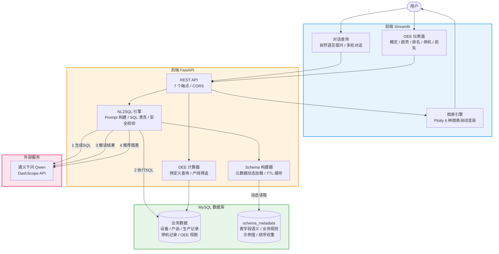
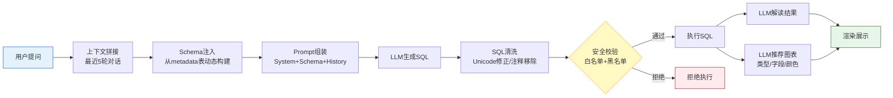
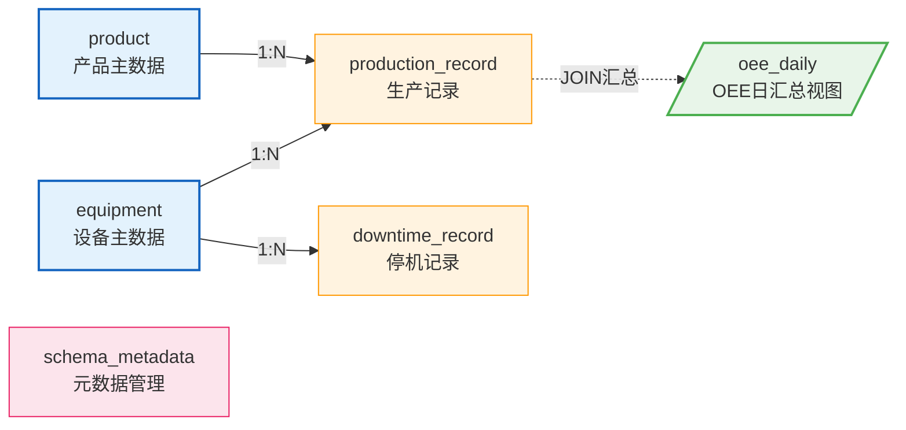
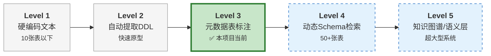
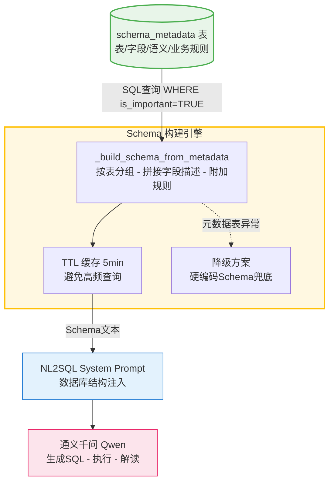

# ChatBI OEE — 智能制造 OEE 分析平台

> **传统仪表盘 + AI 对话分析，智能对话式的OEE可视化分析平台**

制造业的 OEE（Overall Equipment Effectiveness，设备综合效率）分析长期依赖固定报表和预设图表，业务人员难以灵活下钻和自由探索数据。ChatBI OEE 将 **传统 BI 仪表盘** 与 **基于自然语言的智能对话分析** 融合为一体：

- **仪表盘模式** — 提供 OEE 概览、趋势分析、设备排名、停机分析、六大损失等经典可视化面板，支持产线筛选与时间范围切换，满足日常监控与管理汇报需求
- **对话模式** — 用户以中文自然语言提问（如"哪台设备的停机时间最长？"），系统通过 NL2SQL 自动生成 SQL、执行查询、解读结果并推荐最佳图表，实现零门槛的数据探索

在 NL2SQL 工程层面，本项目聚焦于 **Schema 注入方案的实践**，采用 **元数据表集中管理（Level 3）** 策略，将表结构、字段语义、业务规则统一存储在 `schema_metadata` 表中，运行时动态构建 Prompt，兼顾可维护性与 NL2SQL 准确率。

## 演示视频

[](https://www.youtube.com/watch?v=uN0ACWdIo_w)

## 功能特性

### 对话式智能分析

- **自然语言查询** — 输入中文问题，AI 自动生成 SQL 并执行，无需了解数据库结构
- **多轮对话记忆** — 支持最近 5 轮上下文追问，如"上个月呢？""按车间拆分"
- **智能图表推荐** — LLM 根据数据特征自动选择最佳图表类型，支持颜色分类图例
- **结果解读** — AI 对查询结果进行业务解读，给出数据洞察而非仅展示数字

### OEE 可视化仪表盘

- **四大指标概览** — OEE、可用率、性能率、质量率仪表盘，一目了然
- **趋势分析** — 支持按天/周/月聚合，世界级 OEE 85% 达标线标注
- **产线筛选** — 仪表盘全局产线过滤，按需聚焦分析
- **设备排名 & 车间对比** — 横向对比设备效率与车间表现
- **停机分析** — 停机原因分布饼图 + 设备停机时长排名
- **六大损失** — 可用性/性能/质量三维度损失量化

### 工程能力

- **SQL 安全校验** — 白名单 + 黑名单双重防护，仅允许 SELECT 查询
- **Schema 元数据管理** — 表结构语义集中维护，支持动态更新无需重启

## 技术栈

| 层级     | 技术            | 说明                                        |
| -------- | --------------- | ------------------------------------------- |
| LLM      | 通义千问 (Qwen) | DashScope API，NL2SQL + 结果解读 + 图表推荐 |
| 后端     | FastAPI         | REST API 服务，CORS 跨域支持                |
| 前端     | Streamlit       | 多页面应用，对话 + 仪表盘双模式             |
| 数据库   | MySQL 8.0+      | 生产数据存储 + OEE 计算视图                 |
| 数据访问 | SQLAlchemy      | 连接池管理 + 原生 SQL 执行                  |
| 可视化   | Plotly          | 6 种图表类型自动渲染                        |

## 项目结构

```
ChatBI_OEE/
├── backend/                          # 后端服务
│   ├── app/
│   │   ├── main.py                   # FastAPI 入口
│   │   ├── config.py                 # 环境变量配置
│   │   ├── models/
│   │   │   └── database.py           # ORM 模型 (含 SchemaMetadata)
│   │   ├── services/
│   │   │   ├── llm_service.py        # 通义千问 API 封装
│   │   │   ├── nl2sql.py             # NL2SQL 核心引擎
│   │   │   ├── db_service.py         # SQL 执行 + Schema 动态构建
│   │   │   └── oee_calculator.py     # OEE 预定义查询
│   │   ├── api/
│   │   │   └── routes.py             # 7 个 REST API 端点
│   │   └── prompts/
│   │       └── nl2sql_prompt.py      # 三套 Prompt 模板
│   └── requirements.txt
├── frontend/                         # 前端应用
│   ├── app.py                        # Streamlit 主页
│   ├── pages/
│   │   ├── 1_💬_对话查询.py           # 对话查询页面
│   │   └── 2_📈_OEE仪表盘.py         # OEE 仪表盘页面
│   ├── components/
│   │   ├── charts.py                 # Plotly 图表组件 (6种)
│   │   └── sidebar.py                # 侧边栏组件
│   └── requirements.txt
├── database/
│   ├── schema.sql                    # 建表 + 元数据表 + OEE 视图
│   ├── seed_data.sql                 # 3 个月模拟生产数据
│   └── schema_metadata_seed.sql      # Schema 元数据种子数据
├── .env.example                      # 环境变量模板
└── README.md
```

## 系统架构

### 整体架构



### NL2SQL 处理流水线



### 数据库设计

#### ER 关系



#### 表清单

| 表名                  | 类型   | 用途                                                  |
| --------------------- | ------ | ----------------------------------------------------- |
| `equipment`         | 主数据 | 设备编号、名称、类型、车间、产线、理论节拍            |
| `product`           | 主数据 | 产品编号、名称、类别                                  |
| `production_record` | 事务   | 生产记录（实际运行时长、产出、合格数、不良数）        |
| `downtime_record`   | 事务   | 停机事件（类型、分类、原因、时长）                    |
| `oee_daily`         | 视图   | 自动 JOIN 设备+产品，实时计算可用率/性能率/质量率/OEE |
| `schema_metadata`   | 元数据 | NL2SQL Schema 注入的语义标注管理                      |

### Schema 注入方案

本项目实践了 NL2SQL Schema 注入从简单到复杂的演进路径。当前采用 **Level 3（元数据表标注）**，后续可平滑升级到 Level 4（RAG 检索）以支持更大规模的数据库。



#### Schema 注入架构

本项目的核心设计是 **元数据表驱动的 Schema 注入**，取代传统的硬编码方式。



#### 元数据表结构

| 字段              | 说明                                    |
| ----------------- | --------------------------------------- |
| `table_name`    | 表/视图名，`_global` 表示全局业务规则 |
| `column_name`   | 字段名，NULL 表示表级描述               |
| `column_type`   | 字段类型 (如 `INT`、`VARCHAR(50)`)  |
| `description`   | 中文语义描述                            |
| `sample_values` | 示例值/枚举值                           |
| `business_rule` | 业务规则和查询提示                      |
| `is_important`  | 是否注入 Prompt（控制 Schema 精简度）   |
| `sort_order`    | 展示排序权重                            |

#### 日常维护

```sql
-- 新增字段
INSERT INTO schema_metadata (table_name, column_name, column_type, description, sort_order)
VALUES ('equipment', 'new_field', 'VARCHAR(50)', '新字段描述', 10);

-- 修改描述
UPDATE schema_metadata SET description='更新后的描述' WHERE table_name='equipment' AND column_name='workshop';

-- 隐藏字段（不注入 Prompt）
UPDATE schema_metadata SET is_important=FALSE WHERE table_name='downtime_record' AND column_name='id';
```

修改后等待缓存过期（5 分钟）或重启服务即可生效。

## 快速开始

### 1. 环境准备

- Python 3.10+（推荐 Conda 管理）
- MySQL 8.0+
- 通义千问 API Key（[申请地址](https://dashscope.console.aliyun.com/)）

### 2. 创建虚拟环境

```bash
conda create -n chatbi python=3.10 -y
conda activate chatbi
```

### 3. 安装依赖

```bash
pip install -r backend/requirements.txt
pip install -r frontend/requirements.txt
```

### 4. 配置环境变量

```bash
cp .env.example .env
```

编辑 `.env` 文件，填入实际配置：

```env
DASHSCOPE_API_KEY=your_api_key_here
DB_HOST=localhost
DB_PORT=3306
DB_USER=root
DB_PASSWORD=your_password_here
DB_NAME=chatbi_oee
```

### 5. 初始化数据库

进入 MySQL 交互终端，依次执行以下脚本：

```bash
mysql -u root -p
```

```sql
-- 建表（含 schema_metadata 元数据表 + oee_daily 视图）
SOURCE database/schema.sql;

-- 导入模拟生产数据（10 台设备、8 种产品、2026年1-3月工作日数据）
SOURCE database/seed_data.sql;

-- 导入 Schema 元数据（表/字段的中文描述、示例值、业务规则）
SOURCE database/schema_metadata_seed.sql;
```

> **注意**：`seed_data.sql` 使用了存储过程和 `DELIMITER`，必须在 MySQL 交互终端中执行，不能通过管道或重定向方式导入。

### 6. 启动后端

```bash
python -m backend.app.main
```

后端 API 运行在 `http://localhost:8000`，接口文档访问 `http://localhost:8000/docs`。

### 7. 启动前端（新终端窗口）

```bash
streamlit run frontend/app.py
```

前端运行在 `http://localhost:8501`。

### 8. API 接口

| 接口                              | 方法 | 说明                         |
| --------------------------------- | ---- | ---------------------------- |
| `/api/v1/chat`                  | POST | 自然语言查询（支持多轮对话） |
| `/api/v1/oee/overview`          | GET  | OEE 概览（四大指标均值）     |
| `/api/v1/oee/trend`             | GET  | OEE 趋势（按天/周/月聚合）   |
| `/api/v1/oee/equipment-ranking` | GET  | 设备 OEE 排名                |
| `/api/v1/oee/workshop-summary`  | GET  | 车间维度对比                 |
| `/api/v1/oee/downtime-analysis` | GET  | 停机分类分析                 |
| `/api/v1/oee/loss-analysis`     | GET  | 六大损失分析                 |

### 9. 自然语言查询示例

```
"本月OEE最高的设备是哪台？"
"一车间3月份的OEE趋势如何？"
"哪台设备的停机时间最长？"
"各车间的质量率对比情况"
"2月份非计划停机的主要原因是什么？"
"注塑机的可用率和性能率表现"
"生产计划完成率最高的产品是哪个？"
```

### 10. OEE 计算公式

```
OEE = 可用率 × 性能率 × 质量率

可用率(Availability) = 实际运行时间 / 计划生产时间
性能率(Performance)  = (理论节拍 × 总产出) / (实际运行时间 × 60)
质量率(Quality)      = 合格数量 / 总产出数量
```

| 指标   | 世界级水平 | 良好   | 需改善 |
| ------ | ---------- | ------ | ------ |
| OEE    | >= 85%     | 70-85% | < 70%  |
| 可用率 | >= 90%     | —     | —     |
| 性能率 | >= 95%     | —     | —     |
| 质量率 | >= 99%     | —     | —     |

## 作者

**Joyce Pan (潘姣)**

- GitHub：[@sharp-007](https://github.com/sharp-007)
- Email：panjiao007@126.com
- LinkedIn：[joyce-pan-549596138](https://www.linkedin.com/in/joyce-pan-549596138)

如有任何问题或建议，欢迎通过 Issue 交流。

## 开源协议

本项目基于 [MIT License](LICENSE) 开源。
