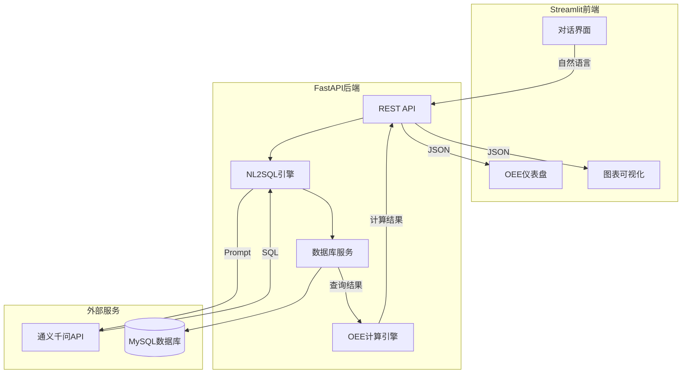

# ChatBI OEE 项目实现计划

## 整体架构




## 项目目录结构

```
ChatBI_OEE/
├── backend/
│   ├── app/
│   │   ├── __init__.py
│   │   ├── main.py              # FastAPI应用入口
│   │   ├── config.py            # 配置管理
│   │   ├── models/
│   │   │   ├── __init__.py
│   │   │   └── database.py      # SQLAlchemy ORM模型
│   │   ├── services/
│   │   │   ├── __init__.py
│   │   │   ├── llm_service.py   # 通义千问LLM调用
│   │   │   ├── nl2sql.py        # 自然语言转SQL核心逻辑
│   │   │   ├── oee_calculator.py # OEE计算引擎
│   │   │   └── db_service.py    # 数据库操作服务
│   │   ├── api/
│   │   │   ├── __init__.py
│   │   │   └── routes.py        # API路由
│   │   └── prompts/
│   │       └── nl2sql_prompt.py # Prompt模板
│   └── requirements.txt
├── frontend/
│   ├── app.py                   # Streamlit主应用
│   ├── pages/
│   │   ├── 1_chat.py            # 对话查询页面
│   │   └── 2_dashboard.py       # OEE仪表盘页面
│   ├── components/
│   │   ├── charts.py            # 图表组件
│   │   └── sidebar.py           # 侧边栏组件
│   └── requirements.txt
├── database/
│   ├── schema.sql               # 数据库建表SQL
│   └── seed_data.sql            # 演示数据填充
├── .env.example                 # 环境变量模板
└── README.md
```

## 数据库设计（OEE模型）

OEE = 可用率(Availability) x 性能率(Performance) x 质量率(Quality)

核心表设计：

- **equipment** - 设备主数据（设备编号、名称、车间、产线、理论节拍）
- **production_plan** - 生产计划（计划时间、设备、产品、计划数量）
- **production_record** - 生产记录（实际运行时间、产出数量、合格数量）
- **downtime_record** - 停机记录（停机类型：计划/非计划、开始/结束时间、原因）
- **oee_daily** - OEE日汇总视图（设备、日期、可用率、性能率、质量率、OEE）

## 核心模块实现

### 1. NL2SQL 引擎

- 将数据库Schema信息注入Prompt，告诉LLM表结构和字段含义
- 使用通义千问 API (dashscope SDK) 将自然语言转为安全的SELECT SQL
- SQL安全校验：仅允许SELECT查询，防止数据篡改
- 查询结果由LLM生成自然语言解读

### 2. OEE 计算引擎

- 封装标准OEE计算公式
- 支持按设备、产线、车间、时间段等维度聚合
- 提供趋势分析（日/周/月）

### 3. Streamlit 前端

- **对话页面**：类ChatGPT对话界面，输入自然语言问题，返回数据表格+图表+文字解读
- **仪表盘页面**：OEE概览仪表盘，包含仪表盘、趋势图、设备排名、停机分析等
- 使用 Plotly 绘制交互式图表

### 4. 演示数据

- 生成3个月的模拟OEE数据（3个车间、10台设备）
- 包含不同停机原因、质量问题场景，使查询结果有意义
